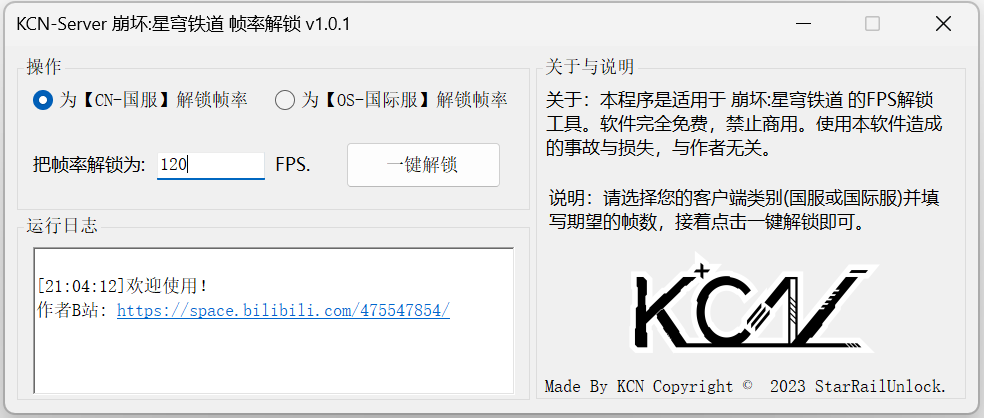

# KCN-StarRail-Unlock

#### 简体中文

> 崩坏:星穹铁道 帧率解锁工具

---

### 软件运行：
- 下载：请到最新 [Releases](https://github.com/JDDKCN/KCN-StarRail-Unlock/releases/) 处下载编译完成的应用程序。
- 自行构建：请下载 [项目源代码](https://github.com/JDDKCN/KCN-StarRail-Unlock/archive/refs/heads/main.zip) 并使用 VisualStudio 编译并运行应用程序。

### 软件截图 ： 
- v1.0.1 2023/04/27

### 更新日志 ： 

- 软件优化 v1.0.1
1. 必须以管理员身份打开软件。否则没有权限，更改失败。

- 初始版本 v1.0.0
1. 构建了程序。

### 使用方法：
- 开始使用
1. 请选择您的客户端类别(国服或国际服)并填写期望的帧数，接着点击一键解锁即可。
- 注意事项
1. 设置的FPS不得大于400，不得小于10。
2. 请选择正确版本的客户端类别。
3. 非管理员模式运行程序会导致修改失败。

### 免责声明：
- 本程序是适用于 崩坏:星穹铁道 的FPS解锁工具，仅供研究交流用。软件完全免费，禁止用于商业及非法用途。使用本软件造成的事故与损失，与作者无关。如果您是花钱买的，说明您被骗了。请尽快退款，以减少您的损失。
